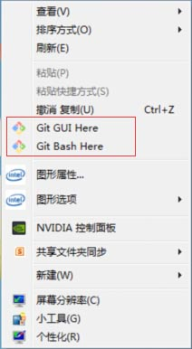
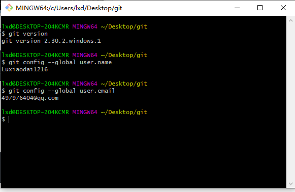
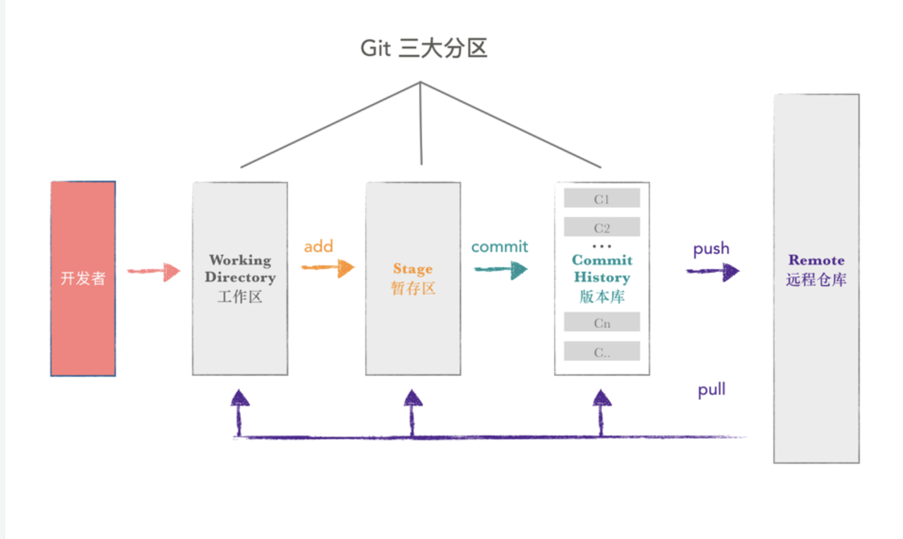
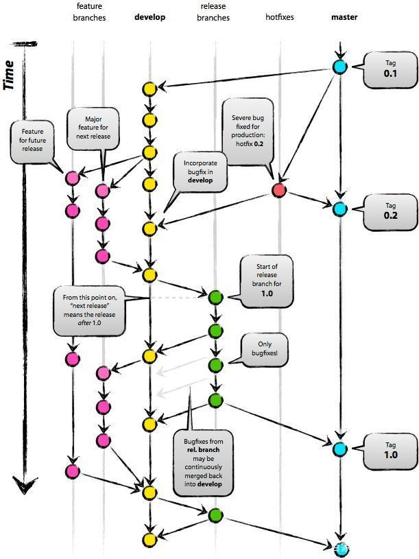

# git基础使用

作者：陆政


## 一 简介

Git 是目前最流行的版本控制系统


## 二 学习网址

- Learn Git Branching 以图形化闯关的形式更直观的了解git流程，强烈推荐学习！

[Learn Git Branching]: https://learngitbranching.js.org/?locale=zh_CN


- ugit是一个教程，使用python来一步一步手动实现GIT，可以了解到git的一些内部实现，有兴趣可以学习

[ugit]: https://www.leshenko.net/p/ugit/


## 三 安装和配置

## 安装git

首先去官网下载git安装包，选择自己对应的系统进行安装

[git官网]: https://git-scm.com/downloads


### windows安装和配置

 打开exe文件，无脑下一步即可，安装完成后鼠标右击 `Git Bash Here`

 

输入 `git version` 可以看到git版本，表示安装成功

接下来在bash中配置用户名和邮箱（向实际托管平台如gitlab或github申请，git只是管理工具）

```
$ git config --global user.name "Your Name"
$ git config --global user.email "email@example.com"
```

配置完查看是否配置成功

```
$ git config --global user.name
$ git config --global user.email
```

 


### Linux安装(TODO)

略


## 四 基本概念

 

**Git 的基本工作流程如下：**

其实上面的流程图，也是在实际工作中的大体流程，简介的概括如下：

1. 在工作区中修改文件。
2. `git add` 命令将文件的快照放入暂存区；
3. `git commit` 提交更新，将快照永久性存储到 Git 本地仓库。
4. `git push` 将本地仓库代码推送到远端仓库，`git pull` 将远端仓库同步到本地


## 五 常见命令(TODO)

### git clone

### git add

### git commit

### git push

### git pull

### git revert

### git checkout

### git merge


## 六 管理规范

### commit日志规范

应该包括三个部分：Header/Body/Footer。其中，**Header是必需的**，Body和Footer可以省略

```
<type>(<scope>): <subject>
// 空一行
<body>
// 空一行
<footer>
```

- Header
  - type用于说明commit的类别，只允许使用以下7个标识
    - `feat`：新功能（feature）
    - `bugfix`：修补bug
    - `docs`：文档（documentation）
    - `style`：格式（不影响代码运行的改动）
    - `refactor`：重构（即不是新增功能，也不是修改bug的代码变动）
    - `test`：增加测试
    - `chore`：构建过程或辅助工具的变动
    - `revert`：撤销某个commit
  - scope用于说明commit影响的范围
  - subject是commit的简短描述
- Body
  - 是对本次commit的详细描述，可以分成多行
- Footer（以下两种情况填写）
  - 不兼容变动：如果当前代码与上一个版本不兼容，则Footer部分是变动的描述以及变动理由和迁移方法
  - 关闭issue：如果当前commit针对某个issue，那么可以在Footer部分关闭这个issue


### 分支管理规范

- 基本原则：`master`为保护分支，不直接在`master`上进行代码修改和提交。

- `dev`分支为主开发分支，需要发布版本时从`dev`分支`checkout`出`release`分支（预发布分支），经测试后合入`master`分支打`Tag`，更新合入到`dev`分支。

- 开发日常需求或者项目时，从`dev`分支上`checkout`一个`feature`进行功能开发或者`bugfix`分支进行`bug`修复，功能测试完毕并且项目发布上线后，将`feature`分支合并到`dev`，最后删除开发分支。分支命名规范：

- - 分支版本命名规则：`分支类型_分支创建时间_分支功能`。比如：`feature_20210313_ceph_obj`
  - 分支类型包括：feature、 bugfix、refactor三种类型，即新功能开发、bug修复和代码重构
  - 时间使用年月日进行命名，不足2位补0
  - 分支功能命名使用snake case命名法，即下划线命名

- Tag包括3位版本，前缀使用v。比如v1.2.31。Tag命名规范：

- - 大版本号使用第1位版本号

  - 新功能开发使用第2位版本号，bug修复使用第3位版本号

  - 可以在大版本发布前使用灰度版本号，在版本后面加上后缀，用中划线分隔。alpha或者belta后面加上次数，即第几次alpha：

  - - v2.0.0-alpha.1

    - v2.0.0-beta.1

    - hotfixes分支用于修正线上问题

    - α测试的目的是评价软件产品的FLURPS（即功能、局域化、可用性、可靠性、性能和支持），为非正式验收测试。

      Beta测试是一种验收测试，通过了验收测试，产品就会进入发布阶段

 


## 七 常见问题(TODO)

#### - 换行符的配置

略

#### - 冲突怎么办

略


